# Workout Tracker

## Live Site

Via Heroku - https://workout-tracker-app-uk-9863ce88581d.herokuapp.com

## Repository

GitHub - https://github.com/DarthCookie45/Workout-tracker-app

## Overview

Workout Tracker is a full-stack web application designed to help users create, manage and track workout routines.

Users can create workout plans, add exercises, schedule workouts in a calendar, monitor progress over time and view personal performance statistics such as personal bests, favourite exercises and total weight lifted.

The application provides a simple and intuitive interface that allows gym-goers and fitness enthusiasts to organise their training and monitor improvements over time.

## Project Goals

The primary goal of the project is to provide users with a central location to manage and track their fitness routines.

The application was designed to solve common problems faced by gym users:

- Remembering workout routines
- Tracking exercise progression
- Monitoring personal bests
- Planning future workouts
- Viewing long-term progress

The application aims to provide a clean and user-friendly experience while storing workout data securely within a relational database.

### User Goals

Users of the application should be able to:

- Create and manage workout routines
- Add exercises to workout routines
- Schedule workouts throughout the week
- Monitor exercise progression over time
- View personal best performances
- Track training statistics
- Reset forgotten passwords securely
- Access workout data from any device

### Site Owner Goals 

The site owner aims to:

- Provide a user-friendly workout management platform
- Demonstrate full-stack web development skills
- Implement secure user authentication and data protection
- Store and retrieve data using a relational database
- Present data visually through charts and statistics
- Create a scalable application that could be expanded with additional fitness features

## Target Audience

The target audience includes:

- Beginner gym users
- Intermediate gym users
- Strength training enthusiasts
- Home workout users
- Individuals following structured workout plans

The application is suitable for users who want a simple way to organise workouts and monitor progression without requiring complex fitness software.

## User Stories

### Authentication
- As a user, I can register an account so that I can store my workout data.
- As a user, I can log in securely so that I can access my routines.
- As a user, I can reset my password if I forget it.

### Workout Management
- As a user, I can create workout routines.
- As a user, I can edit workout routines.
- As a user, I can delete workout routines.
- As a user, I can duplicate workout routines to save time.

### Exercise Management
- As a user, I can add exercises to a workout routine.
- As a user, I can edit exercises.
- As a user, I can delete exercises.
- As a user, I can select exercises from a predefined exercise library.

### Progress Tracking
- As a user, I can view exercise progress charts.
- As a user, I can see my personal best performance.
- As a user, I can monitor long-term progression.

### Scheduling
- As a user, I can schedule workouts on specific days.
- As a user, I can view upcoming workouts in a calendar.

### Profile
- As a user, I can view statistics about my training.
- As a user, I can store my bodyweight for bodyweight exercises.

## User Story Testing

| User Story | Evidence |
|------------|-----------|
| As a user, I can register an account | 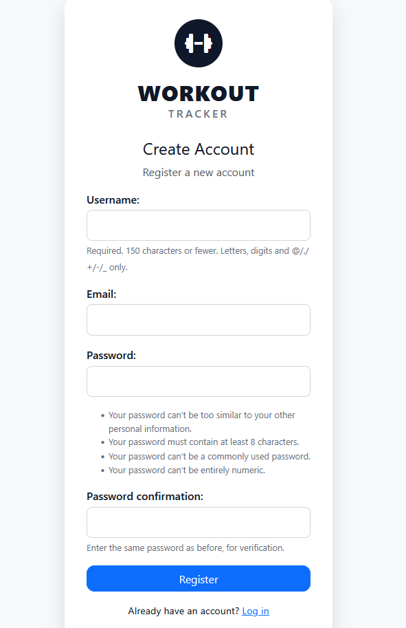 |
| As a user, I can login securely | 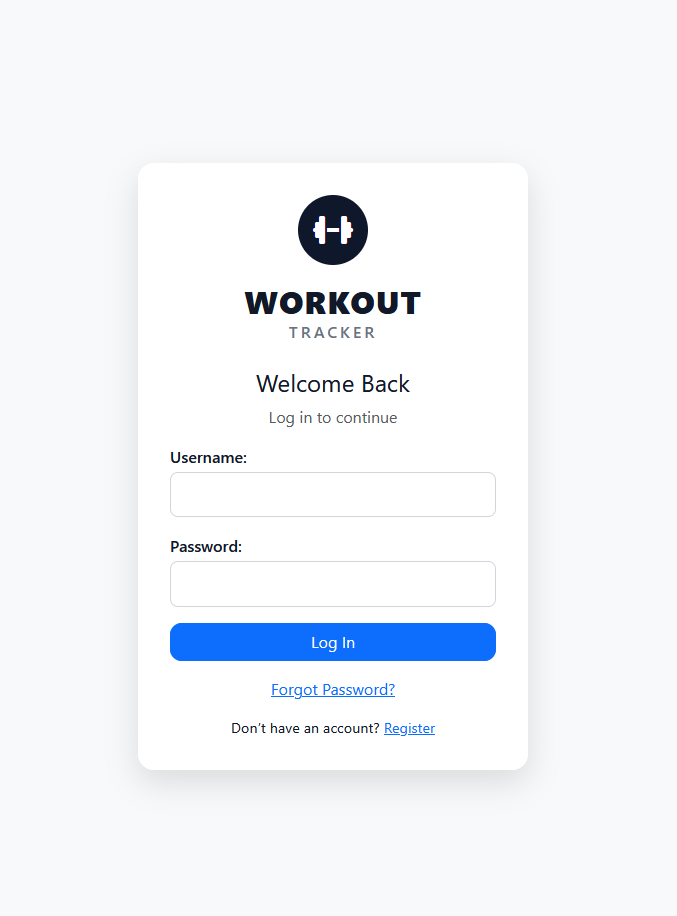 |
| As a user, I can create workout routines | 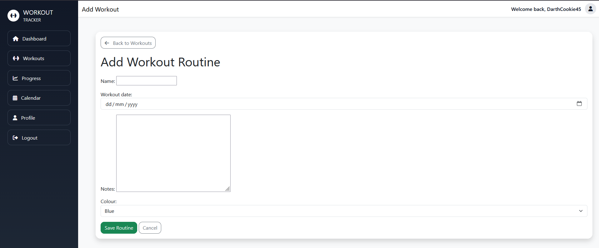 |
| As a user, I can edit workout routines | 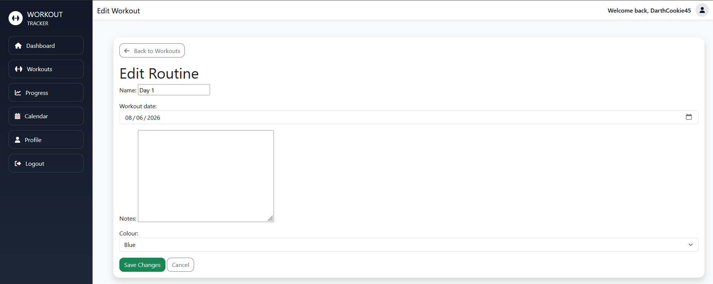 |
| As a user, I can delete workout routines | 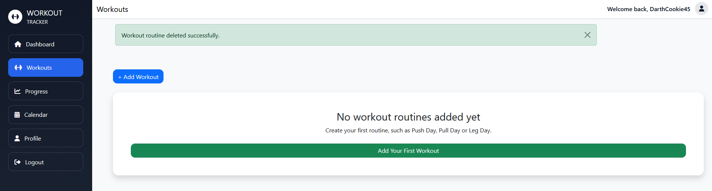 |
| As a user, I can add exercises | 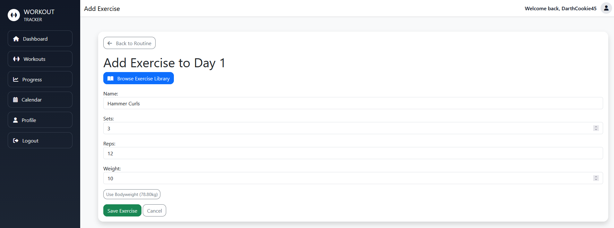 |
| As a user, I can monitor progress | 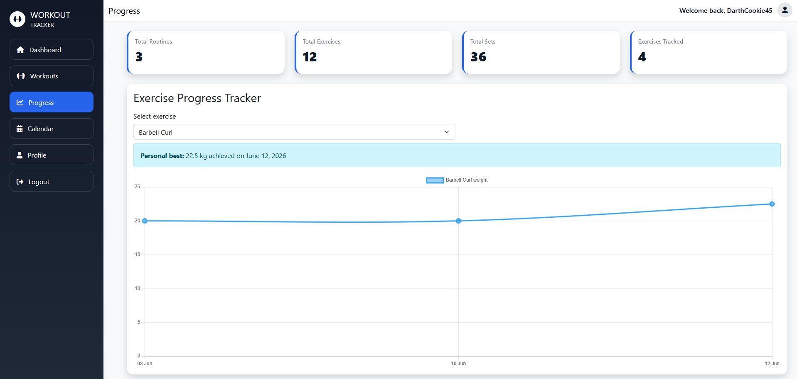 |
| As a user, I can schedule workouts | 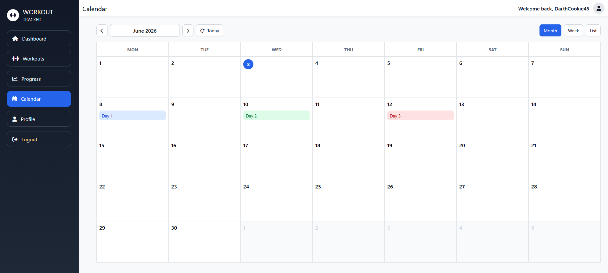 |
| As a user, I can reset my password | 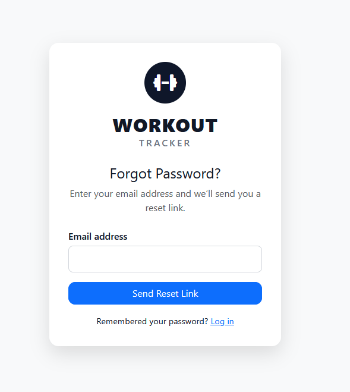 |
| As a user, I can update my profile to change my email address, bodyweight and my password at any time | 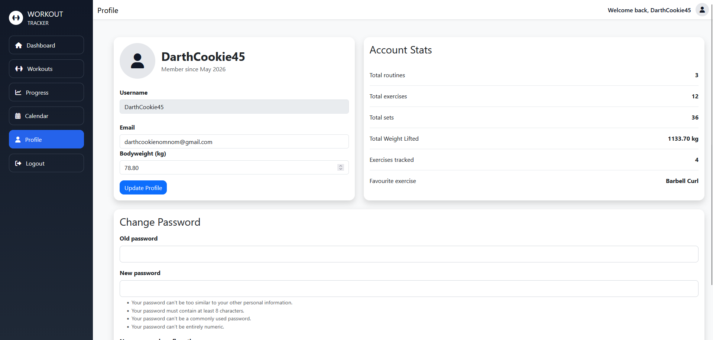 |

## UX Design

### Design Choices

The application uses a clean dashboard-style layout to provide users with quick access to workout information.

A sidebar navigation system was chosen to allow users to move between key areas of the application without becoming lost.

Card-based layouts were used throughout the application to group related information and improve readability

### Colour Scheme

The colour scheme uses:

- Dark blue navigation sidebar
- White content cards
- Blue action buttons
- Green success messages
- Red danger actions

The application uses a consistent dark blue, white and blue colour palette to create a clean dashboard-style interface

### Typography

The application uses modern sans-serif fonts to improve readability across desktop and mobile devices. Text is displayed on plain backgrounds with sufficient contrast, and Bootstrap typography conventions are used to maintain readability across different screen sizes

Font sizes were selected to create a clear visual hierarchy between page headings, statistics and body content

### Wireframes

Wireframes were created during the planning stage of development to establish the overall layout, navigation and user experience of the application.

The final application closely follows the original wireframe designs, with minor improvements made during development to improve usability and responsiveness.

#### Authentication Wireframe

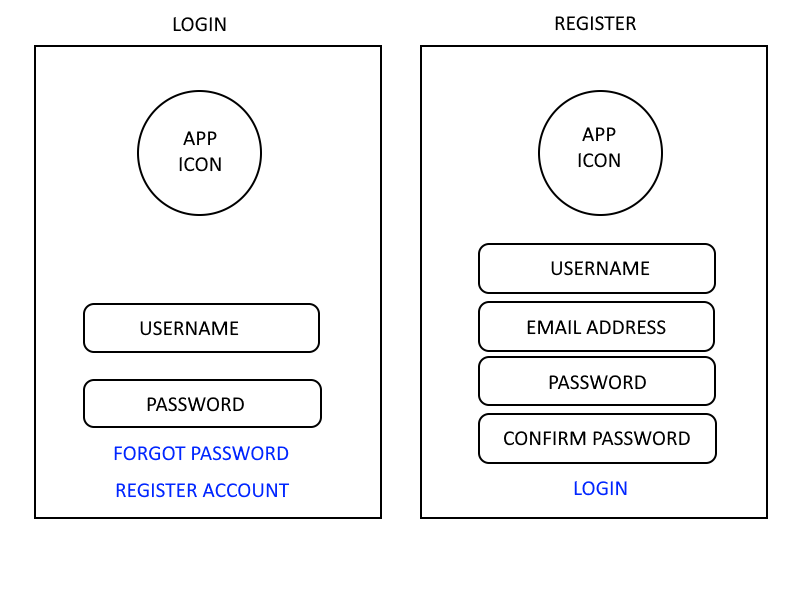

The authentication wireframe was designed to provide users with a simple entry point into the application. The page includes login and registration functionality, allowing users to create an account or access existing workout data securely.

During development, additional validation messages and password reset functionality were introduced to improve usability.

#### Dashboard Wireframe

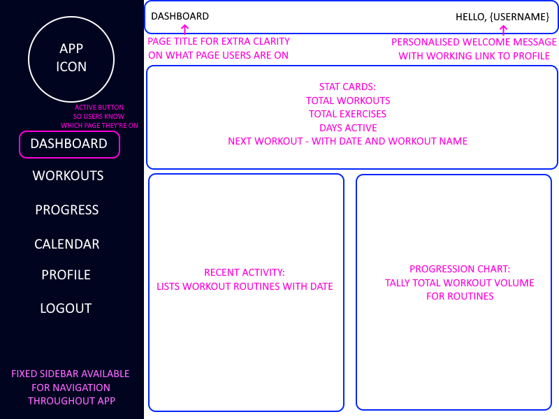

The dashboard was planned as the central hub of the application. It provided users with an overview of workout activity through summary statistics, recent workout information and progress data.

#### Workout Wireframe

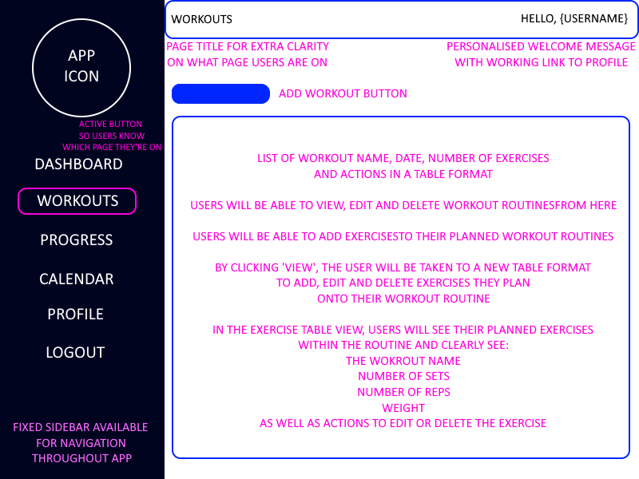

The workouts page was designed to allow users to create, edit and manage workout routines efficiently.

The completed application includes additional functionality such as routine duplication, exercise libraries and colour-coded workout organisation.

#### Progress Wireframe

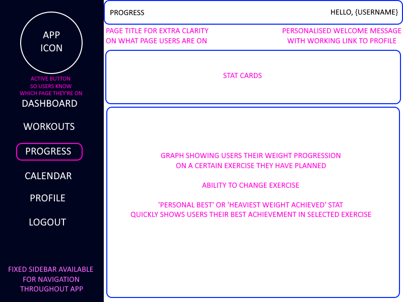

The progress page was designed to provide visual feedback on exercise performance over time. Users can select exercises and monitor progression through charts and statistics.

#### Calendar Wireframe

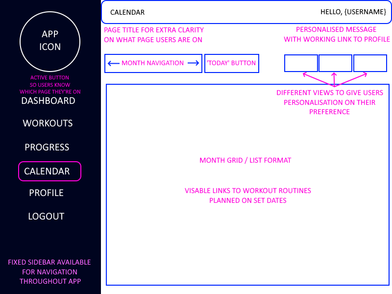

The calendar page was designed to help users organise future workouts and maintain training consistency. The planned layout focussed on clarity and quick navigation between dates.

The final version includes monthly, weekly and list views alongside colour-coded workout scheduling.

#### Profile Wireframe

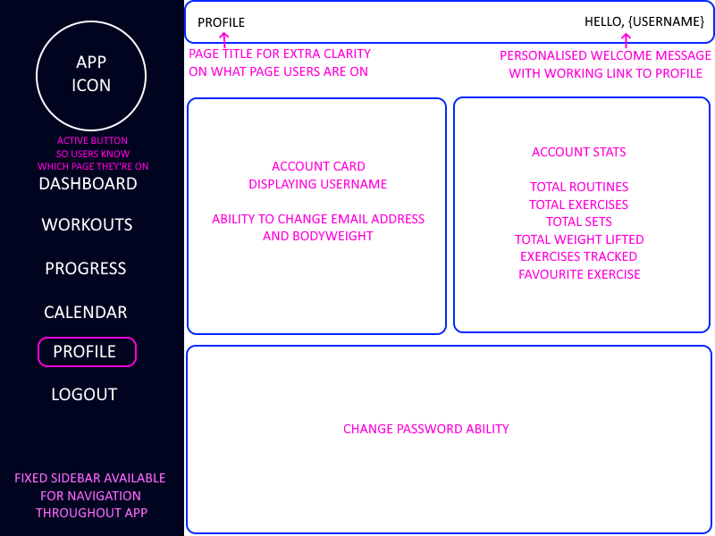

The profile page was designed to provide account management functionality and personalised fitness information.

### Accessibility

Accessibility considerations include:

- Semantic HTML structure
- Clear navigation links
- Consistent button styling
- Colour contrast between text and backgrounds
- Form labels for all inputs
- Keyboard accessible forms and navigation
- User feedback through success and error messages

## Features

### Existing Features

Workout Tracker contains a range of features designed to help users manage workout routines, track exercise progression and monitor training statistics.

Features are grouped into the following sections:

- Authentication
- Dashboard
- Workout Management
- Exercise Management
- Progress Tracking
- Calendar
- Profile
- Password Reset

### Authentication

- User registration
- User login
- User logout
- Password reset via email
- User-specific data protection

### Dashboard

The dashboard acts as the application's homepage for authenticated users

Features include:

- Total workouts statistic
- Total exercises statistic
- Active days statistic
- Upcoming workout card
- Recent workouts list
- Progress overview chart
- Empty-state messaging for new users

The dashboard provides users with an immediate overview of their workout activity and progress

### Workout Management

- Create workouts
- Edit workouts
- Delete workouts
- Duplicate workout routines
- View workout details

### Exercise Management

- Add exercises
- Edit exercises
- Delete exercises
- Exercise library
- Exercise colour coding
- Exercise name normalisation

### Progress Tracking

- Exercise progress charts
- Personal best tracking
- Exercise selection dropdown
- Historical performance tracking
- Total sets statistics
- Exercises tracked statistics

### Calendar

- Monthly view
- Weekly view
- List view
- Workout scheduling

### Profile

The Profile page allows users to manage account information and view training statistics

Features include:

- Email address management
- Password updates
- Bodyweight tracking
- Favourite exercise calculation
- Total weight lifted statistic

### Password Reset

The application includes a fully functional password reset system

Features include:

- Forgot password form
- Email-based password reset
- Secure reset tokens
- Password confirmation
- Custom styled reset pages
- Gmail SMTP integration

Users can securely recover access to their accounts without administrator intervention

### Future Features

- Exercise notes
- Workout reminders
- Dark mode
- Workout sharing
- Customisable Profile picture
- Export history
- Make the workouts into live sessions - go through each exercises sets and allow users to mark them complete while working out.

## Database Design

The application uses a relational database to store user workout information

Relationships:-

User:
- Workouts
- Routines
- Exercises

Workout:
- Linked to User

Routine:
- Linked to User
- Contains many Exercises

Exercise:
- Linked to a Routine

### Entity Relationship Diagram

The Entity Relationship Diagram (ERD) below illustrates the database structure used within the Workout Tracker application

The database was designed using a relational model to ensure data integrity and efficient storage of user workout information

Key relationships include:

- A User can own multiple Workout Routines
- A User has a single Profile containing additional fitness information such as bodyweight
- A Workout Routine can contain multiple Exercises
- A Workout Schedule links a Workout Routine to a specific day of the week
- Individual Exercises belong to a single Workout Routine
- Historical Workout records are linked directly to the User

This structure allows workout information to be organised efficiently while maintaining clear ownership of data and preventing users from accessing records belonging to other accounts

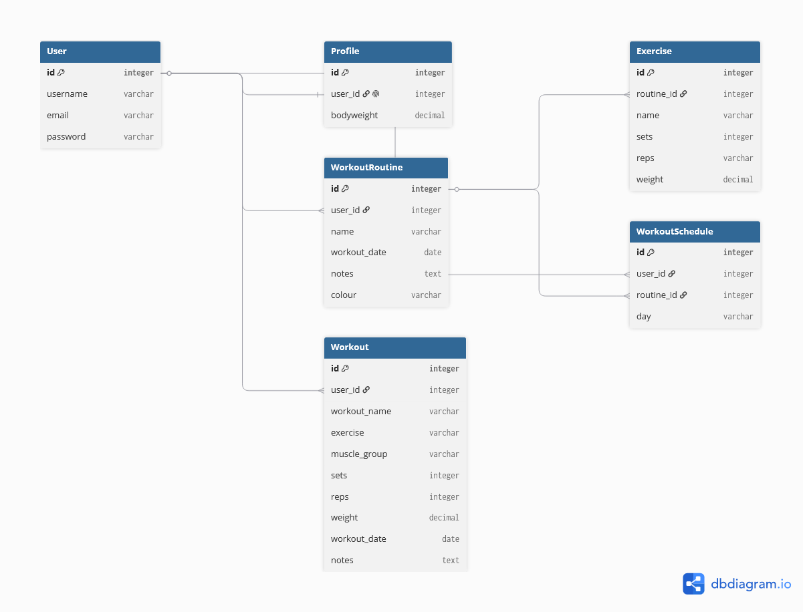

### Data Schema

The database was designed using Django's ORM and follows a relational structure

The schema ensures:

- Data consistency
- User-specific ownership
- Referential integrity
- Efficient querying of workout information

Relationships between models are illustrated in the Entity Relationship Diagram above

#### User

Django's built-in User model is used for authentication. It stores account details such as username, email and password. Passwords are handled by Django's authentication system and are not stored in plain text

#### Workout

The Workout model was created during the early stages of development to store individual workout entries

Fields include:

- workout_name
- exercise
- muscle_group
- sets
- reps
- weight
- workout_date
- notes

The model remains within the database but was superseded by the WorkoutRoutine and Exercise models during later development

#### WorkoutSchedule

The WorkoutSchedule model links workout routines to specific days of the week

Each schedule:

- Belongs to one user
- References one workout routine
- Stores the scheduled day

This model powers the calendar and workout scheduling features

#### Routine

The WorkoutRoutine model stores user-created workout routines

Each routine:

- Belongs to one user
- Has a scheduled workout date
- Supports custom notes
- Supports colour coding for calendar display

A routine may contain multiple exercises

#### Exercise

The Exercise model stores individual exercises belonging to a workout routine

Each exercise contains:

- Name
- Sets
- Repetitions
- Weight

Exercises are linked directly to WorkoutRoutine records through a foreign key relationship

#### Profile

The Profile model extends Django's built-in User model

Each profile stores:

- User bodyweight

The profile is also used to support bodyweight exercise calculations within the application

## Technologies Used


### Languages

- HTML5
- CSS3
- JavaScript
- Python

### Frameworks

- Django 6
- Bootstrap 5

### Libraries 

- Chart.js
- Font Awesome

### Database

- SQLite (development)
- PostgreSQL (production)

### Design Tools

- dbdiagram.io (Entity Relationship Diagram creation)

### Deployment

- Git
- GitHub
- Heroku
- Gunicorn
- WhiteNoise
- Gmail SMTP

## Testing

### Manual Testing

Detailed testing can be found in [TESTING.md](TESTING.md)

A total of 152 tests were completed covering:

- Authentication
- CRUD functionality
- Dashboard
- Progress tracking
- Calendar
- Profile page
- Password reset
- Responsive design

All critical functionality passed testing

Informal testing was conducted with family members and test users throughout development. Feedback was used to improve navigation, profile-functionality, empty-state messaging and password reset workflows

Responsive testing was carried out using browser developer tools at mobile, tablet, laptop and desktop screen sizes. The layout reflows using Bootstrap grid classes and custom CSS, with sidebar navigation adapting for smaller screens

## Automated Testing

No automated unit tests were implemented during development

Testing focused on comprehensive manual testing of all user stories, CRUD functionality, authentication, password reset functionality, responsive design, form validation, deployment testing and browser compatibility testing

All core functionality was manually tested throughout development and again following deployment to Heroku

### Validator Testing

#### HTML

Major user-facing HTML pages were validated using the W3C Markup Validation Service. Validation was carried out on the Login, Registration, Dashboard, Workouts, Workout Detail, Progress, Calendar, Profile and Password Reset pages to ensure compliance with HTML standards and accessibility best practices. Validation was completed after development and any errors or warnings were resolved prior to deployment.

Validator used: https://validator.w3.org/#validate_by_input

| Page name | Result | Screenshot Evidence |
| --- | --- | --- |
| login.html | No errors | 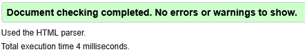 |
| register.html | No errors | 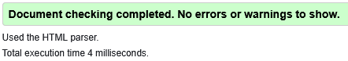 |
| home.html | No errors | 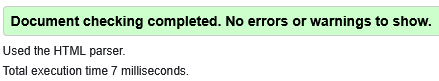 |
| workouts.html | No errors | 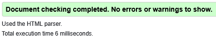 |
| workout_detail.html | No errors | 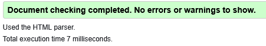 |
| progress.html | No errors | 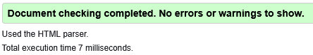 |
| calendar.html | No errors | 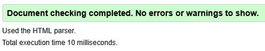 |
| profile.html | No errors | 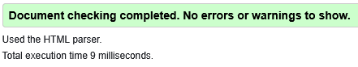 |
| password_reset.html | No errors | 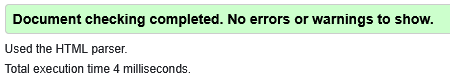 |

#### CSS

The project's CSS stylesheet was validated using the W3C CSS Validation Service to verify that all styling rules followed recognised CSS standards and contained no syntax errors.

Validator used: https://jigsaw.w3.org/css-validator/validator

| Page name | Result | Screenshot Evidence |
| --- | --- | --- |
| style.css | No errors | 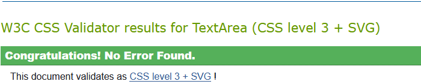 |

#### Python

Core Python application files were validated using the CI Python Linter (PEP8 Validator) to ensure code quality, readability and compliance with PEP 8 style guidelines.

Files validated:

- forms.py
- models.py
- urls.py
- views.py

Validator used: https://pep8ci.herokuapp.com/

| Page name | Result | Screenshot Evidence |
| --- | --- | --- |
| models.py | No errors | 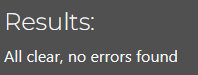 |
| views.py | No errors | 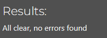 |
| forms.py | No errors | 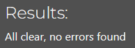 |
| urls.py | No errors | 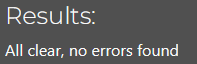 |

### Bugs Fixed

| Bug | Fix |
|------|------------|
| Calendar week navigation displayed incorrect month | Calendar context updated to use selected week date |
| Exercise library added duplicate exercise during edit | Edit workflow updated to overwrite existing exercise |
| Next workout card alignment issue | Bootstrap grid structure corrected |
| Password reset pages displayed Django default templates | Custom tracker templates configured |
| Password reset emails initially displayed "127.0.0.1 team" as the sender | A custom site name and email templates were implemented |
| Exercise naming inconsistency (Push ups vs PUSH UPS) | Name normalisation added to ExerciseForm |
| Missing error feedback when changing password | Warning messages added for validation failures |
| Registration page HTML validation errors | Replaced invalid nested HTML generated by default Django form output |
| Django 6 logout functionality returned a 405 Method Not Allowed error in production | The logout link was updated to use a POST request as required by Django's authentication system |

### Known Bugs

At the time of submission, no known bugs affecting functionality remain

Minor future enhancements have been identified and are listed within the Future Features section

## Deployment

### Local Development

1. Clone repository
2. Create virtual environment
3. Install requirements
4. Create env.py
5. Run migrations
6. Run server

### Heroku Deployment

1. Create a Heroku account and create a new application.
2. Install the required deployment packages:
   - Gunicorn
   - WhiteNoise
   - dj-database-url
   - psycopg2-binary
3. Create a Procfile containing:

   web: gunicorn config.wsgi

4. Update settings.py for production:
   - Configure environment variables
   - Configure PostgreSQL support
   - Configure WhiteNoise static file handling
   - Set DEBUG to False in production
5. Create a Heroku Postgres database and attach it to the application.
6. Configure the following Heroku Config Vars:
   - SECRET_KEY
   - DATABASE_URL
   - API_NINJAS_KEY
   - EMAIL_HOST_USER
   - EMAIL_HOST_PASSWORD
   - DEBUG
7. Connect the Heroku application to the GitHub repository.
8. Enable Automatic Deploys from the main branch.
9. Deploy the application.
10. Run database migrations:

    ```bash
    heroku run python manage.py migrate --app workout-tracker-app-uk
    ```

11. Create a superuser:

    ```bash
    heroku run python manage.py createsuperuser --app workout-tracker-app-uk
    ```

12. Open the deployed application and verify all functionality.

### Development vs Production

The application uses SQLite during local development and PostgreSQL when deployed to Heroku

Environment variables are used in production to secure sensitive credentials including:

- SECRET_KEY
- DATABASE_URL
- API_NINJAS_KEY
- EMAIL_HOST_USER
- EMAIL_HOST_PASSWORD

WhiteNoise is used in production to serve static files and Gunicorn is used as the production web server

### Environment Variables

Environment variables are stored securely using Heroku Config Vars and are excluded from version control via .gitignore

| Variable | Purpose |
| --- | --- |
| SECRET_KEY | Django security key |
| DATABASE_URL | PostgreSQL database connection |
| API_NINJAS_KEY | Exercise library API access |
| EMAIL_HOST_USER | Gmail sender address | 
| EMAIL_HOST_PASSWORD | Gmail app password | 
| DEBUG | Controls development/ production mode |

## Security Features

Security measures include:

- Django authentication system
- Password hashing
- Login required decorators
- User-specific database filtering
- CSRF protection
- Environment variables
- Hidden secret keys
- Production DEBUG disabled
- Secure password reset tokens
- Gmail App Password authentication
- Database ownership validation before editing or deleting records

## Credits

### Code

- Django documentation
- Bootstrap documentation
- Chart.js documentation
- Stack Overflow discussions used for troubleshooting and research

### Media

- Font Awesome icons
- Custom application screenshots created by the developer

### Design Tools

- dbdiagram.io (Entity Relationship Diagram creation)

### Acknowledgements

- Code Institute for project guidance and learning materials
- AI-assisted tools were used for troubleshooting, code explanations, documentation structure and technical terminology throughout development. All implementation, testing, debugging, decision-making and final code integration were completed by the developer
- Family and test users who provided feedback during development and testing
- Images used within the project are limited to icons, wireframes, validation evidence and documentation screenshots. Graphics follow a consistent dark blue and white style and do not distract from the main content. No video or audio content is used